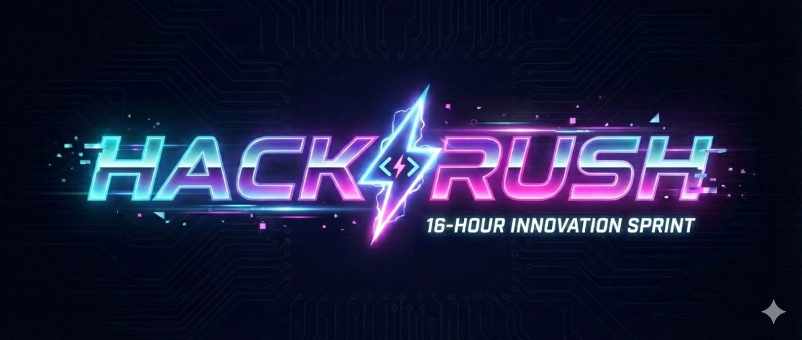

# ⚡ HACKRUSH '26 - Official Website

> The official landing page and portal for **HACKRUSH**, a 15-hour hackathon hosted by the **Etcetera Club** and **IEDC** at **MGM College of Engineering and Technology, Pampakuda**.

---

## 📖 About The Event

**HACKRUSH** is where innovation meets execution. Developers, designers, and problem solvers will converge for 24 hours to build solutions for real-world challenges. This repository contains the source code for the event website.

📍 **Venue:** MGMCET, Pampakuda  
📅 **Date:** 23 - 24 JAN

---

## 📜 Rules & Guidelines

All participants must adhere to the following rules to ensure a fair competition:

### 👥 Team Composition
* **Team Size:** Teams must consist of **2 to 4 members**.
* **Eligibility:** Individual participation is **not** permitted. You must form a team to compete.

### 💻 Tools & Technologies
* **Stack Agnostic:** You are free to use any technology stack, programming language, or framework.
* **Open Source:** The use of open-source libraries and frameworks is highly encouraged.

### 🧠 Originality & Code
* **Fresh Code:** All code must be written **during the hackathon**.
* **No Templates:** The use of pre-built templates or completed projects is strictly prohibited.

### 🤖 AI Usage Policy
* **Allowed:** Generative AI tools (ChatGPT, Copilot, etc.) are permitted to assist in development.
* **Disclosure:** Teams must **disclose** if and how AI tools were used in their project.
* **Ownership:** The core logic and final implementation must be the original work of the team.
---
### 2. Submission Guidelines
Will be updated here soon...
---
### 3. Venue Guidelines
* Participants must bring their own laptops and chargers.
* College ID cards are **mandatory** for entry.
* Rest areas and food will be provided at the venue.
* Any form of harassment or misconduct will result in immediate disqualification (see Code of Conduct).

---

## ⚖️ Judging Criteria
Will be updated here soon....
---

## ✨ Official Website Features

* **Hero Section:** Dynamic introduction with **Particle Background** effects.
* **Registration Portal:** Google forms under MGMCET
* **Tracks Display:** Interactive cards for Problem Statements.
* **Responsive:** Optimized for Mobile and Desktop.

---

## 🛠️ Tech Stack

* **Framework:** React.js (Vite)
* **Styling:** Tailwind CSS
* **Animations:** tsparticles & gsap
* **Deployment:** Vercel

---

## 👥 Organizers

* **Etcetera Club**
* **IEDC MGM Pampakuda**

## 📄 License

This project is licensed under the MIT License - see the [LICENSE](LICENSE.txt) file for details.

---

  Built with ❤️ for HACKRUSH '25

